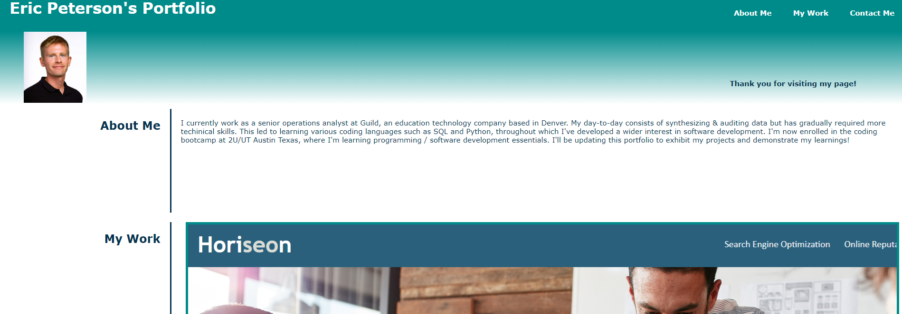

# Eric Peterson's Portfolio

## Description

Part of the curriculum of my coding bootcamp includes weekly projects to practice the prior week's lessons. As of the time of writing, I've completed the following projects:

    (1) a prework study guide that houses important notes on HTML, CSS, Git and JavaScript 
    (2) a mockup SaaS website where I refactored the code to be more accessible
    (3) this portfolio, which I built from scratch and will continue to add to

This portfolio will allow me to showcase my work to future employers. It also serves as a great example of my current web development skills, and I'm sure this project will evolve and improve alongside my skillset. Building this in week 2 of the bootcamp was undisputably challenging, but I learned how to write HTML and CSS together in a real scenario. My goal for this portfolio is to have a sophisticated and impressive display of several projects by the time I apply to jobs.

## Table of Contents

- [Usage](#usage)
- [Credits](#credits)
- [License](#license)

## Usage

My portfolio is hosted on Github pages here:

https://ericlyn4s.github.io/my_portfolio/

The site contains three main sections, which are linked on the top right navigation bar:

    (1) My biography.
    (2) My projects, with my best work highlighted in the main large box. Each box links to the web-hosted site.
    (3) My contact information, with my Gihub and Linkedin profiles linked.

## Credits

I used this tutorial to learn more about the box method: https://www.youtube.com/watch?v=EiNiSFIPIQE

I had a tutoring session with Jacob Carver on 11/7/2023.

## License

MIT License

Copyright (c) 2023 Eric Peterson

Permission is hereby granted, free of charge, to any person obtaining a copy
of this software and associated documentation files (the "Software"), to deal
in the Software without restriction, including without limitation the rights
to use, copy, modify, merge, publish, distribute, sublicense, and/or sell
copies of the Software, and to permit persons to whom the Software is
furnished to do so, subject to the following conditions:

The above copyright notice and this permission notice shall be included in all
copies or substantial portions of the Software.

THE SOFTWARE IS PROVIDED "AS IS", WITHOUT WARRANTY OF ANY KIND, EXPRESS OR
IMPLIED, INCLUDING BUT NOT LIMITED TO THE WARRANTIES OF MERCHANTABILITY,
FITNESS FOR A PARTICULAR PURPOSE AND NONINFRINGEMENT. IN NO EVENT SHALL THE
AUTHORS OR COPYRIGHT HOLDERS BE LIABLE FOR ANY CLAIM, DAMAGES OR OTHER
LIABILITY, WHETHER IN AN ACTION OF CONTRACT, TORT OR OTHERWISE, ARISING FROM,
OUT OF OR IN CONNECTION WITH THE SOFTWARE OR THE USE OR OTHER DEALINGS IN THE
SOFTWARE.
